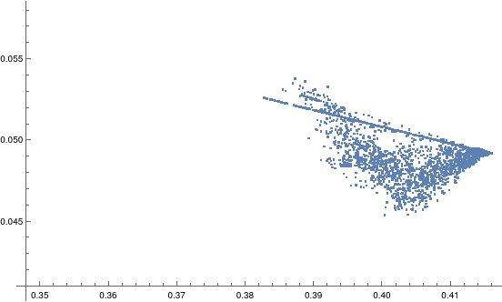
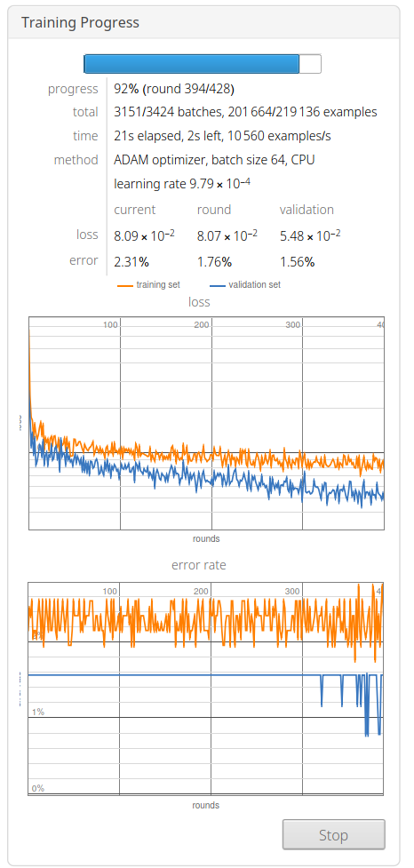

# Friecipe - Friends & Recipes


`AllRecipes.com had no part in the creation of Friecipe`

### Description:

Friecipe tries to predict the taste of different users of the website [AllRecipes]("https://allrecipes.com"). AllRecipes
acts like a social network which revolves around food. Users can create recipes, review recipes of other users, make
connection with other users and even upload pictures of the food they made.

### The Scope of the Project:

By using a vast collection of `recipes` (~100K), `reviews` (~2.5M), `followers`, and `following` (~2.5M combined)
we tried to find correlations between the different ingredients that comprises a recipe and how positively the user
rated said recipe.


```python
def main():
    initial_values = populate_counts(DB, DB.list_collection_names())
    previous_values = initial_values.copy()
    curr_values = initial_values  # Shallow copy

    try:
        while True:
            curr_values = populate_counts(DB, previous_values.keys())
            printer(initial_values, previous_values, curr_values)
            previous_values = curr_values
            sleep(2)
    except KeyboardInterrupt:
        print("\nTotal added:")
        for col in initial_values.keys():
            print(
                f"{col}: {curr_values[col]:,} +{curr_values[col] - initial_values[col]:,} {' ' * 45}"
            )
        sys.exit(0)

```

We achieved the following by clustering recipes according to their ingredients, doing so allowed us to cluster profiles
by their preferences.



### Technologies Used:

The scraper part of the project was written in Python while the Machine Learning part was written in Wolfram
Mathematica. The data was scraped using Selenium over Docker, we also used MongoDB in order to store the scraped data.
Docker Compose was used in order to automatically deploy the different applications.

```
  scraper:
    build: ./scraper
    command: poetry run python ./src/main.py
    environment:
      MONGO_USER: ${MONGO_USER:-root} # Not the best security-wise, temporary solution.
      MONGO_PASS: ${MONGO_PASS:-pass} # Not the best security-wise, temporary solution.
      MONGO_HOST: ${MONGO_HOST:-mongodb}
      MONGO_PORT: ${MONGO_PORT:-27017}
      MONGO_DB: ${MONGO_DB:-scraper}
      MONGO_REVIEWS_COLL: ${MONGO_COLL:-reviews}
      MONGO_RECIPES_COLL: ${MONGO_COLL:-recipes}
      MONGO_PROFILES_COLL: ${MONGO_COLL:-profiles}
      SELENIUM: ${SELENIUM:-selenium}
    depends_on:
      - mongodb # Depends on MongoDB as a DB
      - selenium # Depends on Selenium for the scraping
    restart: always


  selenium:
    image: selenium/standalone-firefox:88.0 # Gecko Driver Docker image base
    ports: # Port mapping
      - 4444:4444
      - 7900:7900
    shm_size: '2gb'
    logging:
      driver: none # Do not print to stdout.
      
```

### Scraping and Entering

We scrape the followers, following, reviews, and favorites of each profile we find and insert those into the database,
moreover we insert the followers and following into a queue of profiles we have yet to visit.

```python
def scrape_contacts(profile_queue: SimpleQueue, profile_id: str, peer_type: str):
    url = format_profile_link(profile_id, peer_type)
    DRIVER.get(url)
    wait_for_load()
    scroll_down_page()

    count = 0
    for contact in DRIVER.find_elements(By.CLASS_NAME, "cook-tile"):
        contact_id = get_id_from_url(contact.find_element(By.TAG_NAME, "a").get_property("href"))
        count += 1
        if count % 100 == 0:
            print(f"Scraped {count} contacts")
        profile_queue.put(contact_id)

    print(f"{count} {peer_type.rstrip('s') + 's'} were collected.")

```

We started with a user with ~650K peers ([AllRecipesMagazine](https://www.allrecipes.com/cook/16007298/)), it was used
as our seed. In order to traverse through all the profiles we run a `Depth First Search` algorithm, finding all peers
for each profile and iterating throughout it all.


### Examples of the objects we used:

Recipes:

```json
{
  "recipe_id": 262145,
  "ingredients": [
    {
      "id": 5044,
      "text": "8 ounces fresh cranberries",
      "quantity": 224
    },
    {
      "id": 1536,
      "text": "7 tablespoons maple syrup",
      "quantity": 140
    },
    {
      "id": 5222,
      "text": "2 ounces fresh raspberries",
      "quantity": 56
    },
    {
      "id": 3743,
      "text": "2 tablespoons chia seeds",
      "quantity": 21
    },
    {
      "id": 5107,
      "text": "1 tablespoon Meyer lemon juice, or to taste",
      "quantity": 15.0484581
    },
    {
      "id": 16424,
      "text": "1 teaspoon vanilla extract",
      "quantity": 4.33333349
    },
    {
      "id": 2496,
      "text": "2 tablespoons water, or more to taste",
      "quantity": 29.57
    }
  ],
  "title": "Cranberry Raspberry Chia Seed Jam",
  "avg_rating": 0
}

```

Reviews:

```json
{
  "id": 6976105,
  "rating": 5,
  "date": "2021-01-22T16:05:06.96",
  "profile_id": 16007298,
  "recipe_id": 213719
}

```

Profiles:

```json
{
  "id": 3771717,
  "name": "cheri",
  "handle": "",
  "country": "[none selected]",
  "region": "",
  "city": ""
}

```

Favorites:

```json
{
  "recipe_id": 244953,
  "profile_id": 12696989,
  "date": "2017-03-07T05:28:21.997"
}

```

### Predicting Taste

In order to predict the taste of users we tried to find how their tastes relate by referencing the reviews we collected
in previous steps.

We used a Deep Learning Neural Network with 6 fully connected linear layers, with ReLU activation functions
(called RAMP in Wolfram Mathematica), we separated the data using the 80/20 ratio, before the separation we had 94%
success rate, while afterwards the prediction was successful 97% of the time!
At last, we used the SoftMax function with the ADAM optimizer.


Training the model


Visualization of users in a two-dimensional space, after vectorization


Visualization of recipes in a two-dimensional space, after vectorization

### Footnotes

Friecipe is a school project for a Data Science course, the data which we use here is all publicly available, we do not
mean any harm by collecting said data.
